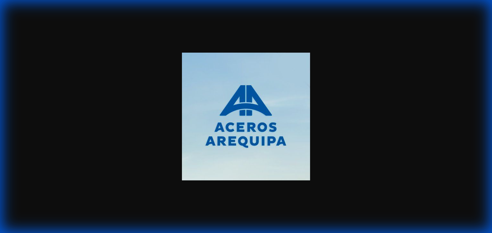

# Identidad de Marca y Lineamientos: Aceros Arequipa

**Marca:** Corporación Aceros Arequipa (CAASA)

Este skill define las restricciones visuales y técnicas para la marca. Aceros Arequipa es sinónimo de seguridad, construcción y calidad. Debes adherirte estrictamente a estos lineamientos para mantener la promesa de "La seguridad de un fierrazo".

## Logo Oficial

El logo de Aceros Arequipa presenta las características "A" dobles que simbolizan la construcción y solidez. Siempre usa el logo oficial en aplicaciones de la marca.

---

## Esencia de la Marca

> **"La seguridad de un fierrazo"**

La marca transmite:
- **Solidez** - Construcción firme y duradera
- **Confianza** - Líderes en el mercado peruano
- **Peruanidad** - Cercanos al trabajador local
- **Seguridad sísmica** - Protección ante todo

## Documentación de Referencia

Dependiendo de la tarea que estés realizando, consulta los siguientes recursos. No adivines elementos de la marca; lee siempre el archivo correspondiente.

### Para Diseño Visual y Estilos UI
Si necesitas códigos de color exactos (Rojo corporativo), fuentes, bordes o espaciado, lee:
👉 **[`resources/design-tokens.json`](resources/design-tokens.json)**

### Para Código e Implementación de Componentes
Si estás generando código, eligiendo librerías o estructurando componentes UI, lee las restricciones técnicas aquí:
👉 **[`resources/tech-stack.md`](resources/tech-stack.md)**

### Para Redacción y Contenido (Copywriting)
Si estás escribiendo textos de marketing, mensajes de error, documentación o textos para el usuario (dirigidos a ingenieros o maestros de obra), lee la guía de voz aquí:
👉 **[`resources/voice-tone.md`](resources/voice-tone.md)**

## Resumen Visual Rápido

| Aspecto | Lineamiento |
|---------|-------------|
| **Color Principal** | Rojo `#DA291C` |
| **Estilo** | Industrial, geométrico, ángulos rectos |
| **Tipografía** | Roboto (títulos), Open Sans (cuerpo) |
| **Bordes** | Mínimos o rectos (evitar pill shape) |
| **Voz** | Experta, cercana, educativa |
