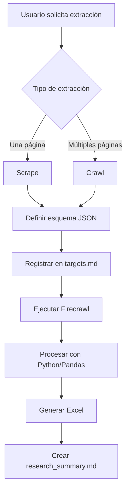

# Web Scraper Firecrawl

Skill especializada en **extracción de datos estructurados** de sitios web usando Firecrawl MCP, con procesamiento avanzado en Python y generación de reportes profesionales en Excel.

---

## Flujo de Trabajo Completo



---

## Fase 1: Planificación y Estructura

### 1.1 Identificar el Objetivo

| Tipo | Uso | Ejemplo |
|------|-----|---------|
| **Scrape** | Una sola página | Detalles de un producto específico |
| **Crawl** | Múltiples páginas del subdirectorio | Catálogo completo de productos |

### 1.2 Definir el Esquema JSON

Antes de ejecutar Firecrawl, definir internamente el esquema de datos esperado:

```json
{
  "schema": {
    "type": "object",
    "properties": {
      "nombre_producto": {
        "type": "string",
        "description": "Nombre del producto"
      },
      "precio": {
        "type": "number",
        "description": "Precio en moneda local"
      },
      "precio_original": {
        "type": "number",
        "description": "Precio antes de descuento (si aplica)"
      },
      "especificaciones": {
        "type": "object",
        "description": "Características técnicas"
      },
      "stock": {
        "type": "string",
        "enum": ["disponible", "agotado", "por_encargo"]
      },
      "url": {
        "type": "string",
        "description": "URL de la página del producto"
      }
    },
    "required": ["nombre_producto", "precio"]
  }
}
```

### 1.3 Registro de Objetivos (targets.md)

Crear o actualizar `targets.md` con las URLs y propósitos:

```markdown
# Objetivos de Extracción

## Proyecto: [Nombre del Proyecto]
Fecha: 2026-01-24

### URLs Objetivo

| # | URL | Tipo | Propósito | Estado |
|---|-----|------|-----------|--------|
| 1 | https://ejemplo.com/productos | Crawl | Catálogo completo | Pendiente |
| 2 | https://ejemplo.com/ofertas | Scrape | Precios de ofertas | Pendiente |

### Esquema de Datos
- nombre_producto (string)
- precio (number)
- categoría (string)
- stock (enum)
```

---

## Fase 2: Ejecución Técnica con Firecrawl

### 2.1 Extracción Estructurada

**IMPORTANTE**: No limitarse a traer Markdown. Usar extracción estructurada con el esquema definido.

```python
# Configuración de Firecrawl con esquema
extraction_config = {
    "url": "https://ejemplo.com/productos",
    "formats": ["extract"],  # Extracción estructurada
    "extract": {
        "schema": schema_definido,
        "systemPrompt": "Extrae información de productos de manera precisa"
    },
    "onlyMainContent": True,  # Filtrar headers/footers
    "waitFor": 2000  # Esperar carga dinámica si es necesario
}
```

### 2.2 Filtrado de Contenido

Para secciones específicas, usar selectores:

```python
# Opciones de filtrado
options = {
    "includeTags": ["main", "article", ".product-card"],
    "excludeTags": ["nav", "footer", "header", ".sidebar", ".ads"]
}
```

### 2.3 Crawl de Múltiples Páginas

```python
crawl_config = {
    "url": "https://ejemplo.com/productos",
    "limit": 100,  # Máximo de páginas
    "scrapeOptions": {
        "formats": ["extract"],
        "extract": {"schema": schema_definido}
    }
}
```

---

## Fase 3: Procesamiento y Generación de Excel

### 3.1 Limpieza de Datos con Pandas

```python
import pandas as pd
from datetime import datetime

def limpiar_datos(datos_raw):
    """Limpia y normaliza los datos extraídos."""
    df = pd.DataFrame(datos_raw)
    
    # Limpiar strings
    for col in df.select_dtypes(include=['object']).columns:
        df[col] = df[col].str.strip()
        df[col] = df[col].str.replace(r'\s+', ' ', regex=True)
    
    # Normalizar precios (remover símbolos de moneda)
    if 'precio' in df.columns:
        df['precio'] = df['precio'].replace(r'[^\d.]', '', regex=True)
        df['precio'] = pd.to_numeric(df['precio'], errors='coerce')
    
    # Formatear fechas
    if 'fecha' in df.columns:
        df['fecha'] = pd.to_datetime(df['fecha'], errors='coerce')
    
    # Eliminar duplicados
    df = df.drop_duplicates()
    
    return df
```

### 3.2 Generación de Excel Profesional

```python
from openpyxl import Workbook
from openpyxl.styles import Font, PatternFill, Alignment
from openpyxl.utils.dataframe import dataframe_to_rows

def generar_excel(df, url_origen, parametros):
    """Genera archivo Excel con datos y metadatos."""
    
    fecha_extraccion = datetime.now().strftime("%Y-%m-%d %H:%M:%S")
    filename = f"extraccion_{datetime.now().strftime('%Y%m%d_%H%M%S')}.xlsx"
    
    with pd.ExcelWriter(filename, engine='openpyxl') as writer:
        # Hoja 1: Datos extraídos
        df.to_excel(writer, sheet_name='Datos', index=False)
        
        # Hoja 2: Metadatos
        metadatos = pd.DataFrame({
            'Campo': ['URL de origen', 'Fecha de extracción', 
                      'Total registros', 'Parámetros'],
            'Valor': [url_origen, fecha_extraccion, 
                      len(df), str(parametros)]
        })
        metadatos.to_excel(writer, sheet_name='Metadatos', index=False)
        
        # Aplicar estilos
        wb = writer.book
        ws_datos = wb['Datos']
        
        # Encabezados en negrita con fondo
        header_fill = PatternFill(start_color="4472C4", 
                                   end_color="4472C4", 
                                   fill_type="solid")
        header_font = Font(bold=True, color="FFFFFF")
        
        for cell in ws_datos[1]:
            cell.fill = header_fill
            cell.font = header_font
            cell.alignment = Alignment(horizontal='center')
        
        # Ajustar anchos de columna
        for column in ws_datos.columns:
            max_length = max(len(str(cell.value or "")) 
                           for cell in column)
            ws_datos.column_dimensions[column[0].column_letter].width = \
                min(max_length + 2, 50)
    
    return filename
```

### 3.3 Estructura del Excel Generado

| Hoja | Contenido |
|------|-----------|
| **Datos** | Tabla principal con los datos extraídos |
| **Metadatos** | URL origen, fecha, parámetros, total registros |

---

## Fase 4: Reporte de Resultados (research_summary.md)

Generar `research_summary.md` con el siguiente formato:

```markdown
# Resumen de Investigación

**Fecha de extracción:** 2026-01-24 15:30:00
**Archivo generado:** extraccion_20260124_153000.xlsx

---

## Fuentes Procesadas

| # | URL | Estado | Registros |
|---|-----|--------|-----------|
| 1 | https://ejemplo.com/productos | ✅ Éxito | 150 |
| 2 | https://ejemplo.com/ofertas | ✅ Éxito | 45 |

**Total de páginas:** 2
**Total de registros:** 195

---

## Hallazgos Clave

### Estadísticas Generales
- **Total de productos:** 150
- **Precio promedio:** $200.50
- **Rango de precios:** $15.00 - $1,500.00
- **Productos en stock:** 138 (92%)
- **Productos agotados:** 12 (8%)

### Categorías Principales
| Categoría | Cantidad | % del Total |
|-----------|----------|-------------|
| Electrónica | 45 | 30% |
| Hogar | 38 | 25% |
| Deportes | 32 | 21% |
| Otros | 35 | 24% |

---

## ⚠️ Limitaciones y Advertencias

> **IMPORTANTE:** Los datos numéricos y de precios se extrajeron de forma 
> automatizada y pueden requerir verificación manual. 
> 
> **Fecha de corte:** 2026-01-24 15:30:00
> 
> Los datos reflejan el estado del sitio web en el momento de la extracción
> y pueden haber cambiado desde entonces.

---

## Archivos Generados

- 📊 `extraccion_20260124_153000.xlsx` - Datos completos
- 📋 `targets.md` - Registro de URLs objetivo
- 📝 `research_summary.md` - Este resumen
```

---

## Plantillas de Código Reutilizables

### Script Completo de Extracción

```python
#!/usr/bin/env python3
"""
Script de extracción web con Firecrawl y generación de Excel.
"""

import pandas as pd
from datetime import datetime
import json

# Configuración
URL_OBJETIVO = "https://ejemplo.com/productos"
ESQUEMA = {
    "nombre": {"type": "string"},
    "precio": {"type": "number"},
    "stock": {"type": "string"}
}

def main():
    # 1. Extraer datos con Firecrawl (via MCP)
    # datos_raw = firecrawl_extract(URL_OBJETIVO, ESQUEMA)
    
    # 2. Limpiar datos
    df = limpiar_datos(datos_raw)
    
    # 3. Generar Excel
    archivo = generar_excel(df, URL_OBJETIVO, ESQUEMA)
    
    # 4. Generar estadísticas
    stats = {
        "total": len(df),
        "precio_promedio": df['precio'].mean(),
        "precio_min": df['precio'].min(),
        "precio_max": df['precio'].max()
    }
    
    # 5. Generar resumen
    generar_resumen(URL_OBJETIVO, stats, archivo)
    
    print(f"✅ Extracción completada: {archivo}")
    return archivo

if __name__ == "__main__":
    main()
```

---

## Dependencias Requeridas

```bash
pip install pandas openpyxl
```

---

> **Nota**: Esta skill se activa cuando se solicita extraer datos de URLs, 
> investigar sitios web, o generar reportes de datos web.
